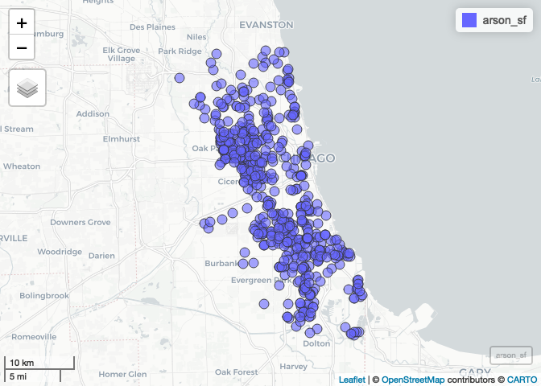

Part 1 - Completed Version
================
Christopher Prener, Ph.D.
(June 17, 2021)

## Introduction

This notebook provides a walk-through of the code for the first part of
our lesson. We’ll cover reading in tabular data, projecting it so that
it can be mapped, and create some simple interactive maps using the
`leaflet` JavaScript library along the way. We’ll also talk about
geographic coordinate systems.

## Dependencies

This notebook requires the following packages:

``` r
# tidyverse packages
library(magrittr)     # pipe operator
library(readr)        # csv tools

# mapping packages
library(mapview)      # preview spatial data
library(leaflet)      # interactive maps
library(sf)           # spatial tools
```

    ## Linking to GEOS 3.8.1, GDAL 3.2.1, PROJ 7.2.1

``` r
# other packages
library(here)         # file path management
```

    ## here() starts at /Users/chris/GitHub/slu-dss/gis-extended

## Leaflet

As a way to get to know `R` and RStudio, we’ll be working with the `R`
package [`leaflet`](https://rstudio.github.io/leaflet/). `leaflet` is
the `R` implementation of [`leaflet.js`](http://leafletjs.com), an
open-source Java Script library for building interactive maps.

### A Simple Map

`leaflet` itself is straightforward to get up and running. If we wanted
an interactive map with a marker placed on-top of Chapin Hall, we would
use the following script entered into `R`:

``` r
leaflet() %>%
  addTiles() %>%
  addMarkers(lng = -87.59267827941107, lat = 41.785848099872744, popup="Chapin Hall")
```

<!-- -->

The `leaflet()` function creates a map widget, and the `addTiles()`
function adds a base map to it. By default,
[OpenStreetMap](https://www.openstreetmap.org) is used for the base map.
Finally, we use `addMarkers()` to specify the longitude and latitude of
our marker, and we enter in a label that will appear as a pop-up when a
user clicks on the marker. `lng`, `lat`, and `popup` are all called
“arguments” - these are used to control how a function operates.

The `%>%` is called the “pipe operator”, and it is used to chain
together functions in what we will call “pipelines”. This pipeline can
be read like a list, with the word **then** substituted for each
instance of `%>%`:

1.  First we create a map widget, **then**
2.  we add base map tiles, **then**
3.  we add a marker at the given longitude and latitude.

### Changing the Base Map

To alter the base map, we can use `addProviderTiles()` in place of
`addTiles()`. I like the CartoDB “Positron” base map. To use the
Positron base map, we create a second pipeline:

``` r
leaflet() %>%
  addProviderTiles(providers$CartoDB.Positron) %>%
  addMarkers(lng = -87.59267827941107, lat = 41.785848099872744, popup="Chapin Hall")
```

<!-- -->

Two things are important to note here. When we load the `leaflet`
package, we have access to a data object called `providers`. You can use
the following syntax to explore it:

``` r
names(providers)
```

    ##   [1] "OpenStreetMap"                      
    ##   [2] "OpenStreetMap.Mapnik"               
    ##   [3] "OpenStreetMap.DE"                   
    ##   [4] "OpenStreetMap.CH"                   
    ##   [5] "OpenStreetMap.France"               
    ##   [6] "OpenStreetMap.HOT"                  
    ##   [7] "OpenStreetMap.BZH"                  
    ##   [8] "OpenSeaMap"                         
    ##   [9] "OpenPtMap"                          
    ##  [10] "OpenTopoMap"                        
    ##  [11] "OpenRailwayMap"                     
    ##  [12] "OpenFireMap"                        
    ##  [13] "SafeCast"                           
    ##  [14] "Thunderforest"                      
    ##  [15] "Thunderforest.OpenCycleMap"         
    ##  [16] "Thunderforest.Transport"            
    ##  [17] "Thunderforest.TransportDark"        
    ##  [18] "Thunderforest.SpinalMap"            
    ##  [19] "Thunderforest.Landscape"            
    ##  [20] "Thunderforest.Outdoors"             
    ##  [21] "Thunderforest.Pioneer"              
    ##  [22] "Thunderforest.MobileAtlas"          
    ##  [23] "Thunderforest.Neighbourhood"        
    ##  [24] "OpenMapSurfer"                      
    ##  [25] "OpenMapSurfer.Roads"                
    ##  [26] "OpenMapSurfer.Hybrid"               
    ##  [27] "OpenMapSurfer.AdminBounds"          
    ##  [28] "OpenMapSurfer.ContourLines"         
    ##  [29] "OpenMapSurfer.Hillshade"            
    ##  [30] "OpenMapSurfer.ElementsAtRisk"       
    ##  [31] "Hydda"                              
    ##  [32] "Hydda.Full"                         
    ##  [33] "Hydda.Base"                         
    ##  [34] "Hydda.RoadsAndLabels"               
    ##  [35] "MapBox"                             
    ##  [36] "Stamen"                             
    ##  [37] "Stamen.Toner"                       
    ##  [38] "Stamen.TonerBackground"             
    ##  [39] "Stamen.TonerHybrid"                 
    ##  [40] "Stamen.TonerLines"                  
    ##  [41] "Stamen.TonerLabels"                 
    ##  [42] "Stamen.TonerLite"                   
    ##  [43] "Stamen.Watercolor"                  
    ##  [44] "Stamen.Terrain"                     
    ##  [45] "Stamen.TerrainBackground"           
    ##  [46] "Stamen.TerrainLabels"               
    ##  [47] "Stamen.TopOSMRelief"                
    ##  [48] "Stamen.TopOSMFeatures"              
    ##  [49] "TomTom"                             
    ##  [50] "TomTom.Basic"                       
    ##  [51] "TomTom.Hybrid"                      
    ##  [52] "TomTom.Labels"                      
    ##  [53] "Esri"                               
    ##  [54] "Esri.WorldStreetMap"                
    ##  [55] "Esri.DeLorme"                       
    ##  [56] "Esri.WorldTopoMap"                  
    ##  [57] "Esri.WorldImagery"                  
    ##  [58] "Esri.WorldTerrain"                  
    ##  [59] "Esri.WorldShadedRelief"             
    ##  [60] "Esri.WorldPhysical"                 
    ##  [61] "Esri.OceanBasemap"                  
    ##  [62] "Esri.NatGeoWorldMap"                
    ##  [63] "Esri.WorldGrayCanvas"               
    ##  [64] "OpenWeatherMap"                     
    ##  [65] "OpenWeatherMap.Clouds"              
    ##  [66] "OpenWeatherMap.CloudsClassic"       
    ##  [67] "OpenWeatherMap.Precipitation"       
    ##  [68] "OpenWeatherMap.PrecipitationClassic"
    ##  [69] "OpenWeatherMap.Rain"                
    ##  [70] "OpenWeatherMap.RainClassic"         
    ##  [71] "OpenWeatherMap.Pressure"            
    ##  [72] "OpenWeatherMap.PressureContour"     
    ##  [73] "OpenWeatherMap.Wind"                
    ##  [74] "OpenWeatherMap.Temperature"         
    ##  [75] "OpenWeatherMap.Snow"                
    ##  [76] "HERE"                               
    ##  [77] "HERE.normalDay"                     
    ##  [78] "HERE.normalDayCustom"               
    ##  [79] "HERE.normalDayGrey"                 
    ##  [80] "HERE.normalDayMobile"               
    ##  [81] "HERE.normalDayGreyMobile"           
    ##  [82] "HERE.normalDayTransit"              
    ##  [83] "HERE.normalDayTransitMobile"        
    ##  [84] "HERE.normalDayTraffic"              
    ##  [85] "HERE.normalNight"                   
    ##  [86] "HERE.normalNightMobile"             
    ##  [87] "HERE.normalNightGrey"               
    ##  [88] "HERE.normalNightGreyMobile"         
    ##  [89] "HERE.normalNightTransit"            
    ##  [90] "HERE.normalNightTransitMobile"      
    ##  [91] "HERE.reducedDay"                    
    ##  [92] "HERE.reducedNight"                  
    ##  [93] "HERE.basicMap"                      
    ##  [94] "HERE.mapLabels"                     
    ##  [95] "HERE.trafficFlow"                   
    ##  [96] "HERE.carnavDayGrey"                 
    ##  [97] "HERE.hybridDay"                     
    ##  [98] "HERE.hybridDayMobile"               
    ##  [99] "HERE.hybridDayTransit"              
    ## [100] "HERE.hybridDayGrey"                 
    ## [101] "HERE.hybridDayTraffic"              
    ## [102] "HERE.pedestrianDay"                 
    ## [103] "HERE.pedestrianNight"               
    ## [104] "HERE.satelliteDay"                  
    ## [105] "HERE.terrainDay"                    
    ## [106] "HERE.terrainDayMobile"              
    ## [107] "FreeMapSK"                          
    ## [108] "MtbMap"                             
    ## [109] "CartoDB"                            
    ## [110] "CartoDB.Positron"                   
    ## [111] "CartoDB.PositronNoLabels"           
    ## [112] "CartoDB.PositronOnlyLabels"         
    ## [113] "CartoDB.DarkMatter"                 
    ## [114] "CartoDB.DarkMatterNoLabels"         
    ## [115] "CartoDB.DarkMatterOnlyLabels"       
    ## [116] "CartoDB.Voyager"                    
    ## [117] "CartoDB.VoyagerNoLabels"            
    ## [118] "CartoDB.VoyagerOnlyLabels"          
    ## [119] "CartoDB.VoyagerLabelsUnder"         
    ## [120] "HikeBike"                           
    ## [121] "HikeBike.HikeBike"                  
    ## [122] "HikeBike.HillShading"               
    ## [123] "BasemapAT"                          
    ## [124] "BasemapAT.basemap"                  
    ## [125] "BasemapAT.grau"                     
    ## [126] "BasemapAT.overlay"                  
    ## [127] "BasemapAT.highdpi"                  
    ## [128] "BasemapAT.orthofoto"                
    ## [129] "nlmaps"                             
    ## [130] "nlmaps.standaard"                   
    ## [131] "nlmaps.pastel"                      
    ## [132] "nlmaps.grijs"                       
    ## [133] "nlmaps.luchtfoto"                   
    ## [134] "NASAGIBS"                           
    ## [135] "NASAGIBS.ModisTerraTrueColorCR"     
    ## [136] "NASAGIBS.ModisTerraBands367CR"      
    ## [137] "NASAGIBS.ViirsEarthAtNight2012"     
    ## [138] "NASAGIBS.ModisTerraLSTDay"          
    ## [139] "NASAGIBS.ModisTerraSnowCover"       
    ## [140] "NASAGIBS.ModisTerraAOD"             
    ## [141] "NASAGIBS.ModisTerraChlorophyll"     
    ## [142] "NLS"                                
    ## [143] "JusticeMap"                         
    ## [144] "JusticeMap.income"                  
    ## [145] "JusticeMap.americanIndian"          
    ## [146] "JusticeMap.asian"                   
    ## [147] "JusticeMap.black"                   
    ## [148] "JusticeMap.hispanic"                
    ## [149] "JusticeMap.multi"                   
    ## [150] "JusticeMap.nonWhite"                
    ## [151] "JusticeMap.white"                   
    ## [152] "JusticeMap.plurality"               
    ## [153] "Wikimedia"                          
    ## [154] "GeoportailFrance"                   
    ## [155] "GeoportailFrance.parcels"           
    ## [156] "GeoportailFrance.ignMaps"           
    ## [157] "GeoportailFrance.maps"              
    ## [158] "GeoportailFrance.orthos"            
    ## [159] "OneMapSG"                           
    ## [160] "OneMapSG.Default"                   
    ## [161] "OneMapSG.Night"                     
    ## [162] "OneMapSG.Original"                  
    ## [163] "OneMapSG.Grey"                      
    ## [164] "OneMapSG.LandLot"

`providers` is a vector of items, each of which corresponds to a
different base map. We can select one of those items,
`CartoDB.Positron`, by separating `providers` from the item name with a
dollar sign (`$`). This is a classic way in which elements of a data set
are accessed in `R` syntax.

Now, you try to select a base map from `providers` and alter the code
chunk from above to reproduce the map showing Chapin Hall:

``` r
leaflet() %>%
  addProviderTiles(providers$CartoDB.DarkMatter) %>%
  addMarkers(lng = -87.59267827941107, lat = 41.785848099872744, popup="Chapin Hall")
```

<!-- -->

### Adding Additional Points

The `data/woodlawn_homicide.csv` file (a `.csv` file is a type of
spreadsheet) contains information on recent homicides in Chicago’s
Woodlawn neighborhood. We can read it into `R` using the `readr` package
(part of the tidyverse):

``` r
woodlawn <- read_csv(here("data", "woodlawn_homicide.csv"))
```

    ## 
    ## ── Column specification ────────────────────────────────────────────────────────
    ## cols(
    ##   case_number = col_character(),
    ##   date_of_occurrence = col_character(),
    ##   primary_description = col_character(),
    ##   latitude = col_double(),
    ##   longitude = col_double()
    ## )

We read the statement from right to left - the data found at
`data/woodlawn_homicide.csv` is read correctly as `.csv` data, and the
resulting imported data is stored in an object in our global environment
named `woodlawn`. The `here()` function helps us write simple, operating
system agnostic file paths that will always be relative to where the
`.Rproj` file is stored. We’ll talk more about this as the semester
progresses.

We can explore the data a number of ways, including with the `View()`
(output not shown) function and the `str()` function:

``` r
str(woodlawn)
```

    ## spec_tbl_df [16 × 5] (S3: spec_tbl_df/tbl_df/tbl/data.frame)
    ##  $ case_number        : chr [1:16] "JD365439" "JE119595" "JE136378" "JE115131" ...
    ##  $ date_of_occurrence : chr [1:16] "09/13/2020 12:17:00 AM" "01/21/2021 10:28:00 PM" "02/08/2021 08:30:00 PM" "01/17/2021 08:36:00 AM" ...
    ##  $ primary_description: chr [1:16] "HOMICIDE" "HOMICIDE" "HOMICIDE" "HOMICIDE" ...
    ##  $ latitude           : num [1:16] 41.8 41.8 41.8 41.8 41.8 ...
    ##  $ longitude          : num [1:16] -87.6 -87.6 -87.6 -87.6 -87.6 ...
    ##  - attr(*, "spec")=
    ##   .. cols(
    ##   ..   case_number = col_character(),
    ##   ..   date_of_occurrence = col_character(),
    ##   ..   primary_description = col_character(),
    ##   ..   latitude = col_double(),
    ##   ..   longitude = col_double()
    ##   .. )

If we wanted to use `View()`, it would be implemented like this:

``` r
View(woodlawn)
```

When executed in the console, it will produce a spreadsheet-like view
within RStudio.

The `.csv` data are *tabular* data - they contain longitude and latitude
data, but they are not *projected*. This means we are missing the
geometric data that locates these longitude and latitude data in space.
leaflet can take these spatial references, however, and convert them to
usable geometric data. We do so using a very similar process to what we
did before:

``` r
leaflet(data = woodlawn) %>%
  addProviderTiles(providers$CartoDB.Positron) %>%
  addMarkers(lng = ~longitude, lat = ~latitude, popup = ~date_of_occurrence)
```

<!-- -->

The `data = woodlawn` argument in `leaflet()` directs `R` to the
appropriate data set to map. We use the tilde (`~`) to indicate to
leaflet that these are variables within `woodlawn`.

## Converting to `sf` Objects

In practice, we don’t usually build maps this way. Instead, we convert
our tabular data to an `sf` object, which contains a `geometry` column
that is ready for mapping and spatial data wrangling. We’ll load a
larger data set of homicides to illustrate this process:

``` r
## load data
homicide <- read_csv(here("data", "chicago_homicide.csv"))
```

    ## 
    ## ── Column specification ────────────────────────────────────────────────────────
    ## cols(
    ##   case_number = col_character(),
    ##   date_of_occurrence = col_character(),
    ##   primary_description = col_character(),
    ##   latitude = col_double(),
    ##   longitude = col_double()
    ## )

``` r
## project data
homicide_sf <- st_as_sf(homicide, coords = c("longitude", "latitude"), crs = 4269)
```

The `longitude` and `latitude` columns contain our `x` and `y` values
for coordinates, respectively. Longitude lines are the vertical lines
that extend east and west from the prime meridian. Latitude lines are
the horizontal lines that extend north and south from the equator.

The `crs` value of `4269` refers to a *geographic coordinate system,*
which is a model of the earth’s surface that expresses locations in
decimal degrees. These are another way of representing longitude and
latitude. `4269` is known as “NAD83,” which stands for North American
Datum 1983. This is a model that is specific to North America. The other
common geographic coordinate system we use is WGS84, which can be used
anywhere in the world. Its `crs` value is `4326`.

Once we build `homicide_sf`, we can see that its properties have
changed:

``` r
class(homicide)
```

    ## [1] "spec_tbl_df" "tbl_df"      "tbl"         "data.frame"

``` r
class(homicide_sf)
```

    ## [1] "sf"         "tbl_df"     "tbl"        "data.frame"

We can also easily start to work with our data. For example, we can use
`View()` (or click on our object in the global environment) to get a
sense of its columns and rows. Note the `geometry` column - this
contains the information `R` packages need to create maps with our data.

We can also use the `mapview` package to preview our data:

``` r
mapview(homicide_sf)
```

<!-- -->

This is particularly useful for making sure data have been projected
correctly, and getting a sense of the spatial *extent* of our data.

Now, you repeat the process of loading and projecting data using the
file `data/chicago_arson.csv`, which contains locations of recent arson
fires in Chicago. Be sure to check your variable names, as they are
different than in the `homicide` data.

``` r
## load data
arson <- read_csv(here("data", "chicago_arson.csv"))
```

    ## 
    ## ── Column specification ────────────────────────────────────────────────────────
    ## cols(
    ##   case = col_character(),
    ##   date = col_character(),
    ##   descrip = col_character(),
    ##   lat = col_double(),
    ##   long = col_double()
    ## )

``` r
## project data
arson_sf <- st_as_sf(arson, coords = c("long", "lat"), crs = 4269)

## preview data
mapview(arson_sf)
```

<!-- -->

## Prepping Our Data

In order to map our data properly with `leaflet`, they must use the WGS
84 *geographic coordinate system*. As we noted above, the EPSG code for
WGS 84 is `4326`. To make our transformations, we’ll use
`st_transform()` paired with our selected EPSG code:

``` r
homicide_sf <- st_transform(homicide_sf, crs = 4326)
```

Now, you try this syntax out on the demographic data:

``` r
arson_sf <- st_transform(arson_sf, crs = 4326)
```

## Creating Interactive Maps

Finally, we’ll build some simple interactive maps. Since our data are
`sf` objects, we no longer need to specify the `latitude` and
`longitude` columns. This makes our code a bit easier to read and write!
We use the homicide data’s incident date combined with a little html
code to make our pop-up:

``` r
leaflet() %>%
  addProviderTiles(providers$CartoDB.Positron) %>%
  addMarkers(data = homicide_sf,
             popup = paste("<b>Date:</b> ", homicide_sf$date_of_occurrence))
```

<!-- -->

Now, you repeat this process for the arson data, swapping out out both
the base map, the data object, and any variable names that may have
changed:

``` r
leaflet() %>%
  addProviderTiles(providers$Esri.NatGeoWorldMap) %>%
  addMarkers(data = arson_sf,
             popup = paste("<b>Date:</b> ", arson_sf$date))
```

<!-- -->
